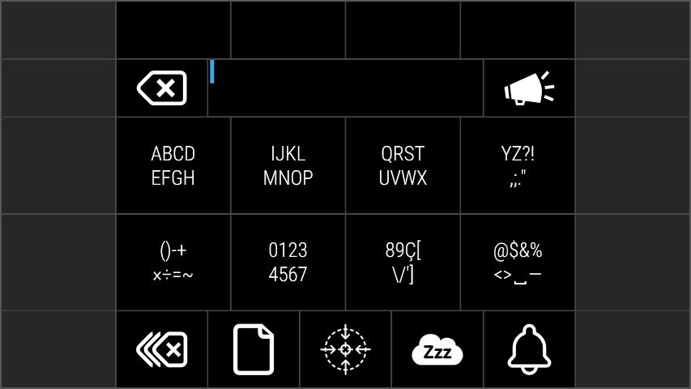
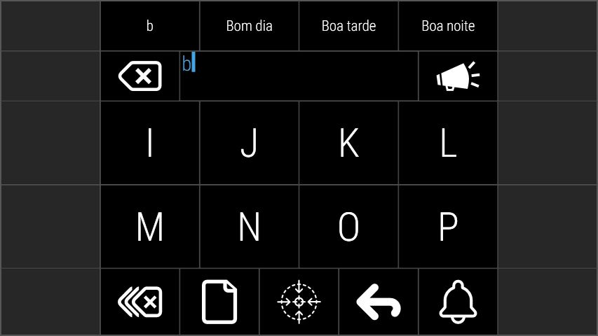

# optikey-keyboard-scripts

Some scripts written in Python 3 to generate nested Dynamic Keyboards for the Optikey.

Today the keyboard is as follows:

See the [#855](https://github.com/OptiKey/OptiKey/issues/855) issue at the Optikey project.
